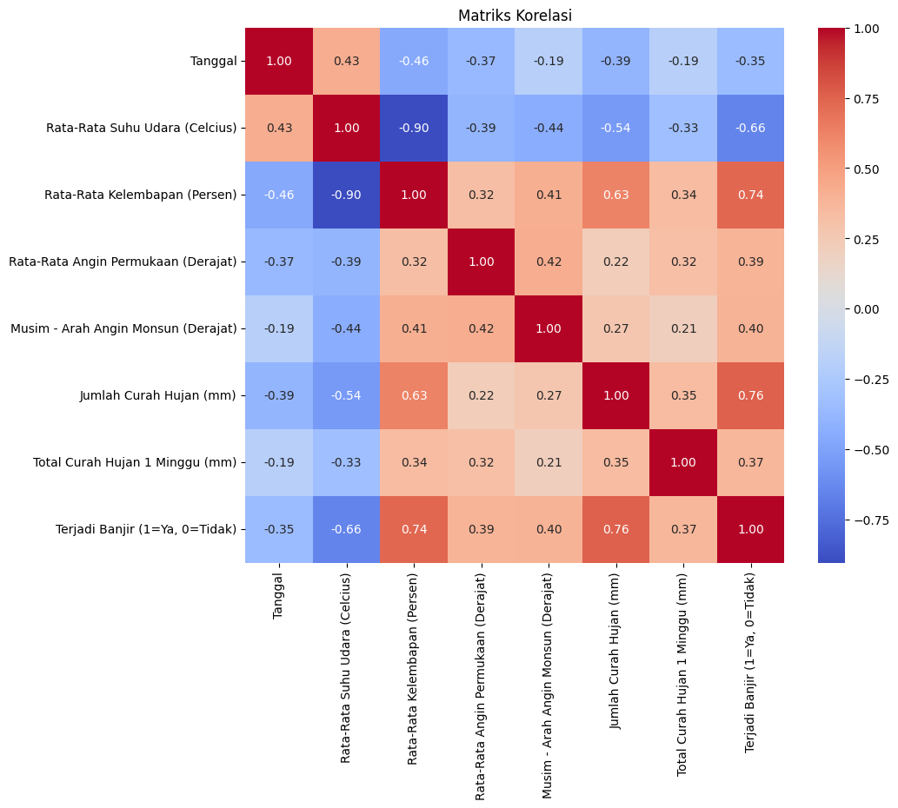
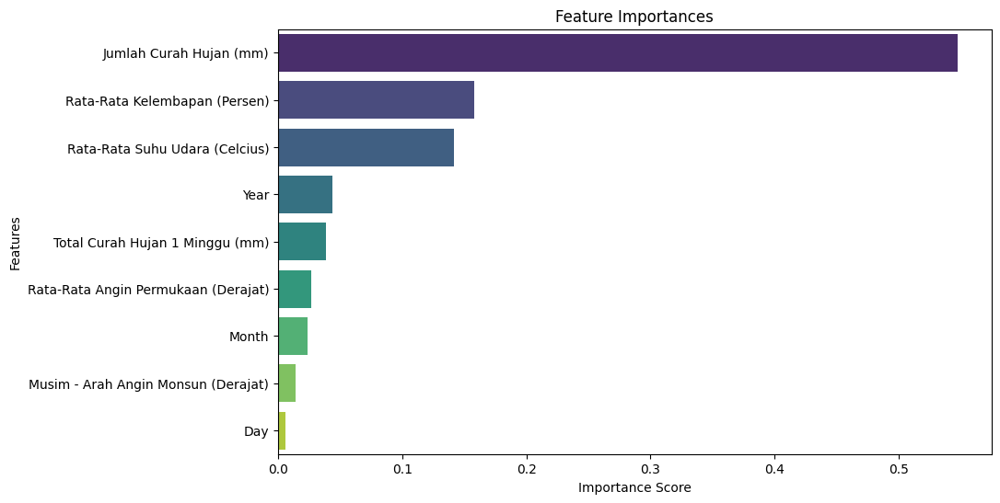

# 🌧️ Flood Prediction System – Bandar Lampung

**Predicting flood events using meteorological data and machine learning.**  
An **end-to-end Data Science project** utilizing **Python** and a **Random Forest Classifier** to predict flood occurrences in **Bandar Lampung (2010–2020)** based on key weather indicators.

---

## Project Overview

This project aims to develop a **flood prediction model** for Bandar Lampung using **data mining and machine learning techniques**.  
The main objectives are:
- Identify key meteorological variables influencing flood occurrence  
- Build a predictive model that supports **early warning and disaster management systems**

The workflow follows an **end-to-end data science pipeline**, including:
1. Data understanding and exploration  
2. Data preprocessing and feature engineering  
3. Model development using Random Forest  
4. Model evaluation and validation  
5. Visualization and interactive dashboard deployment  

---

## Key Insights

| Factor | Correlation with Flood |
|--------|------------------------|
| **Weekly Rainfall** | **1.00 (Strongest Predictor)** |
| **Daily Rainfall** | 0.76 |
| **Humidity** | 0.74 |
| **Air Temperature** | 0.63 |

> High rainfall accumulation, elevated humidity, and increased temperature strongly correlate with flood occurrence in Bandar Lampung.

---

## Data Description

The dataset contains **historical meteorological observations and flood event records** from **Bandar Lampung (2010–2020)**, including:

- Air Temperature (°C)  
- Humidity (%)  
- Rainfall (mm/day and mm/week)  
- Surface Wind Direction & Monsoon Pattern  
- Temporal Features (Year, Month, Day)

> Data was cleaned, standardized, and normalized to ensure analytical consistency and model reliability.

---

## Data Preparation & Tools

Data preprocessing and transformation were performed using **Python** with the following libraries:

| Step | Tools / Libraries | Description |
|------|--------------------|--------------|
| Data Cleaning | `pandas`, `numpy` | Handling missing values, duplicates, and formatting inconsistencies |
| Feature Engineering | `datetime`, `pandas` | Extracting `year`, `month`, `day` features from date columns |
| Data Normalization | `sklearn.preprocessing` | Scaling features to 0–1 range for consistent model training |
| Exploratory Analysis | `matplotlib`, `seaborn` | Visualizing distributions, correlations, and relationships |
| Feature Selection | `sklearn.feature_selection`, `pandas.corr()` | Identifying top predictors of flood events |

> The correlation matrix (below) highlights rainfall, humidity, and temperature as the dominant predictors of flood events.

---

## Correlation Matrix Analysis

  

**Interpretation:**  
The correlation matrix visualizes relationships among meteorological variables and flood occurrences (`Terjadi Banjir`).

Key findings:
- **Rainfall (Curah Hujan)** shows the strongest positive correlation (**0.76**) with flood events.  
- **Humidity** also has a high correlation (**0.74**), showing a strong link with moist weather conditions during floods.  
- **Temperature** correlates moderately (**0.63**) and is inversely related to **humidity (-0.90)** — typical for tropical climates.  

> 💡 **Insight:** Flood occurrence in Bandar Lampung is primarily influenced by rainfall accumulation and humidity levels, which serve as key early warning indicators.

---

## Model Specification

| Component | Description |
|------------|-------------|
| **Algorithm** | Random Forest Classifier |
| **Estimators** | 50 trees |
| **Weights** | Balanced class weights |
| **Validation** | Stratified 5-Fold Cross Validation |
| **Split Ratio** | 70% Train / 30% Test |
| **Libraries** | `scikit-learn`, `pandas`, `numpy`, `matplotlib`, `seaborn` |

---

## Evaluation Results

| Metric | Score |
|--------|--------|
| **Accuracy** | 93.3% |
| **Recall** | 100% |
| **Precision** | 85.7% |
| **AUC-ROC** | 94.4% |
| **OOB Score** | 97% |
| **Cross-Validation Mean** | 90% |

> ✅ The model successfully identified **all flood cases (Recall = 1.0)** while maintaining high precision and excellent generalization.

---

## Feature Importance Analysis

  

**Interpretation:**  
This chart ranks the contribution of each variable to the Random Forest model’s decision-making process.

Key insights:
- **Total Rainfall (mm)** is the most dominant predictor (**0.55** importance score).  
- **Humidity** and **Temperature** follow closely, confirming their high correlation with flood risk.  
- Temporal variables (Year, Month, Day) have minor influence, meaning flood risk depends more on **weather conditions** than seasonal timeframes.

> 💡 **Conclusion:** The Random Forest model heavily relies on rainfall, humidity, and temperature to predict flood occurrences accurately.

---

## Interactive Dashboard

A responsive dashboard was developed using **Tailwind CSS** and **Chart.js** to visualize model insights.

**Dashboard Features:**
- Model performance metrics (Accuracy, Recall, Precision, AUC)
- Feature importance ranking  
- Confusion matrix visualization  
- Correlation matrix display  
- OOB and cross-validation metrics  

  

<em>Figure: Interactive dashboard visualizing model metrics and feature impact.</em>

  

---

## Project Architecture
